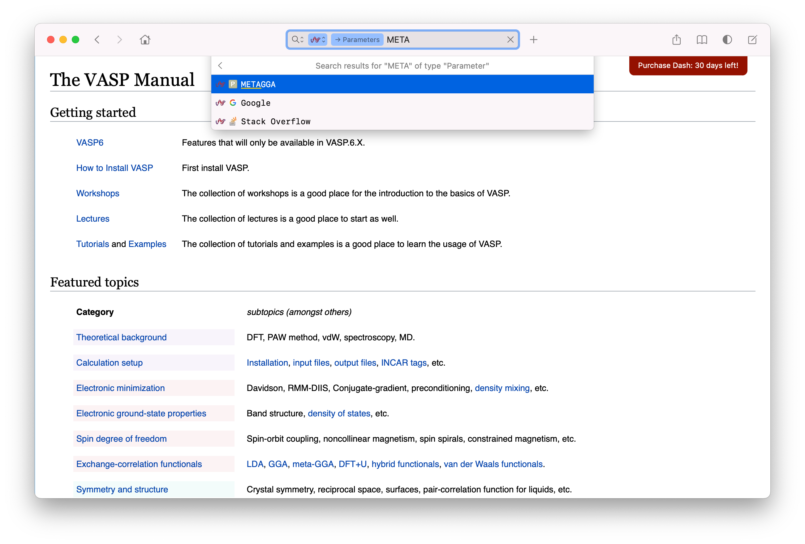

# VASP Docset

[VASP](https://www.vasp.at/) (Vienna _ab initio_ simulation package) docset for [Dash](http://kapeli.com/dash/).



## How to scrape and build docset

First, install the required dependencies

```
python3 -m pip install -r requirements.txt
```

then run the scripts

```bash
mkdir -p vasp.docset/Contents/Resources/Documents
python3 scripts/scrape.py
python3 scripts/vaspdoc2set.py
```

## Licence

- The code is licenced under the [MIT Licence](LICENCE).
- The original VASP document is licenced under [GNU Free Documentation License 1.2](https://www.gnu.org/licenses/old-licenses/fdl-1.2.txt).
